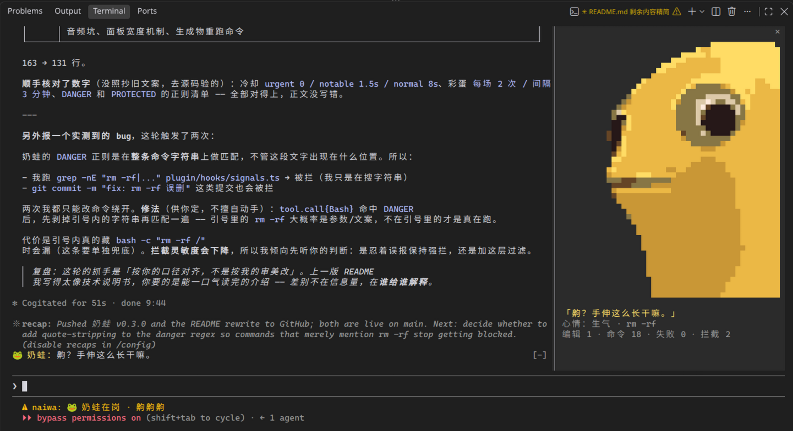
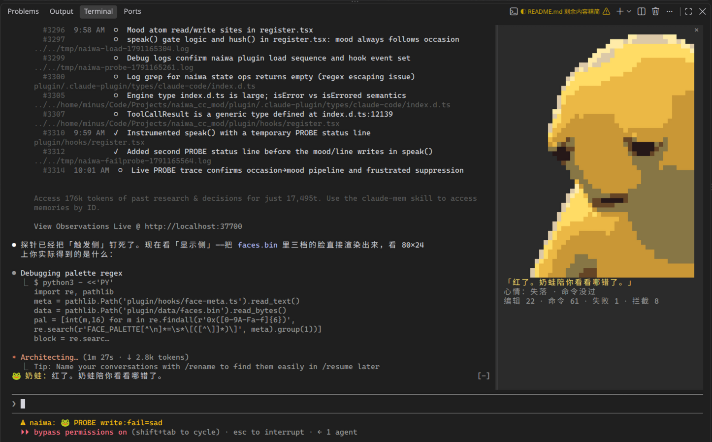

# 奶蛙陪你写代码 🐸

一只 Claude Code 桌宠。变异奶龙住进你的终端，陪你上班 —— 根据终端里发生的事自己换心情，
在你敲 `rm -rf /` 的时候生气地一巴掌摁住你的手。



测试报错爆红的时候它失落。


18:00 之后又开一次 cc，它会爆笑 10 秒。


形式是 Claude Code ≥ 2.1.287 的**原生插件**（不是第三方框架）。功能形态对齐
[`CocoSgt/yujie-mod`](https://github.com/CocoSgt/yujie-mod)，形象和说话方式是原创角色。

---

## 装

复制这两行，粘到终端里回车：

```bash
claude plugin marketplace add chenmochaos/naiwa_cc_mod
claude plugin install naiwa@naiwa
```

装完**重启一次 claude**（退出当前会话，重新敲 `claude`），进去敲：

```
/naiwa
```

奶蛙就上岗了。这个开关它自己记得，以后每场会话自动出现，不用再敲。

以后想收拾它：

```bash
claude plugin update naiwa        # 出了新版本时更新（更新完同样要重启）
claude plugin uninstall naiwa     # 卸载，走干净
```

### 只想先试试，不想真装

```bash
git clone https://github.com/chenmochaos/naiwa_cc_mod.git ~/naiwa_cc_mod
claude --plugin-dir ~/naiwa_cc_mod/plugin
```

这条只管当前这次会话，关掉就没了，不碰你任何配置。

---

## 命令

| 命令 | 干什么 |
| --- | --- |
| `/naiwa` | **开关**。打开后奶蛙常驻，每场会话自动出现；再敲一次让它下班。开关会记住，重启也还在 |
| `/naiwa-laugh` | 放完整彩蛋：103 帧动画 + 原声 + 台词条，约 10.3 秒 |
| `/naiwa-talk` | 开关奶蛙口吻（会注进 system prompt）。默认**关** |

---

## 它会做什么

**心情跟着终端内容自己变** —— 四档：平静 / 生气 / 大笑 / 失落。

- **台词跟着你说的话走**。你提 `bug` 它就引用 `bug`，你说"上线了"它跟着庆祝。开场、你不顺、
  你在乐、报里程碑这几个时刻，它会调一次 LLM 现编一句；调不通就静默换回本地台词，不报错、不卡。
- **心情自己切**。命令挂了、测试挂了、你说丧气话 → 失落；拦下危险命令、有人要动密钥 → 生气；
  好玩的事 → 大笑。生气瞪的是那件危险的事，失落陪的是你。
- **自动彩蛋**：整套测试跑全绿、或连挂几次之后翻盘，自动放一次大笑动画。每场最多 2 次 ——
  放太勤就不叫彩蛋了。
- **下班彩蛋**：18:00 之后第一次开会话自动放一次，当天只放一次。

**面板大小自适应。** 面板上是像素头像 + 当前台词 + 心情 + 判断依据，**没有一个要你点的东西** ——
心情是它自己判的，不是按出来的。终端给多少行就画多大：140×40 画全身，80×24 只剩 6 行就换小脸，
矮到连小脸都放不下就退成纯文字，**面板始终在**。

窄终端（比如 80×24）里 6 行会被小脸占满，一个字都排不下，所以心情同时写在台词条上：
`🐸 奶蛙 · 失落：…`。**看不看得见面板，心情都在。**

**危险命令拦截。** `rm -rf /`、`git push -f`、`git reset --hard`、`mkfs`、`dd of=/dev/*`、
fork 炸弹这一类别，命中就直接 deny —— 命令根本不交给引擎，脸和台词一起变生气。

只拦真危险的，不误伤日常：`rm -rf build/`、`rm -rf node_modules` 照常放行；`grep "rm -rf" .`、
提交信息里提到 `rm -rf` 也不拦 —— 引号里的是文字，不是命令。

**密钥保护。** `Edit` / `Write` 碰 `.env`、`.ssh/`、`id_rsa`、`*.pem` 一律 deny。

它**不会一直说话**：编辑成功、普通命令成功这些只计数不开口，开口分三档冷却（拦截立刻说、
失败类 1.5 秒、寒暄类 8 秒）。但冷却只压"同一件事别重复说"，**心情翻篇了一定会说** ——
刚打完招呼第一条命令就挂，脸和台词条立刻跟着变。

**音效**：彩蛋原声交给系统播放器放 —— Linux 上是 `paplay` / `ffplay`，两个都没装的话那一次
就是静音，不报错，也不影响动画和别的功能。
